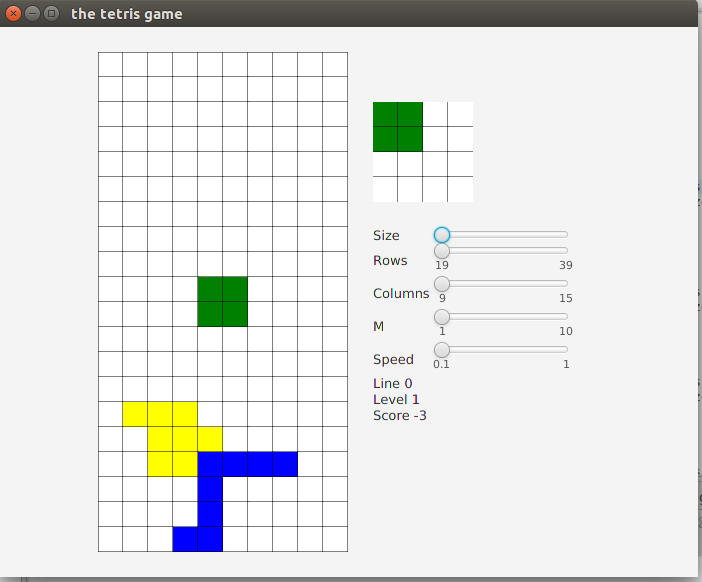

# tetris
Tetris game written in JavaFX for my Computer Graphics Assignment CS 6366

# screenshots

When the game starts

# Software Requirements

* Have Eclipse Oxygen Version 4.7.2 or later installed on your Windows, Linux or Mac machine

# Starting the game in a development environment

* For linux and mac
  * open the terminal
  * cd into the eclipse-workspace directory (or any workspace you have created in eclipse)
  * `git clone git@github.com:saayv1/tetris.git`
  * open Eclipse Oxygen
  * choose the workspace you used earlier to clone this repository
  * select the 'tetris' folder in the Package Explorer
  * Navigate to src and open the Tetris.java file
  * Hit the green play icon to start the game
  
# Controls

* left mouse button to move the brick left
* right mouse button to move the brick right
* cursor on the board indicates pause
* cursor on the moving piece changes the piece

